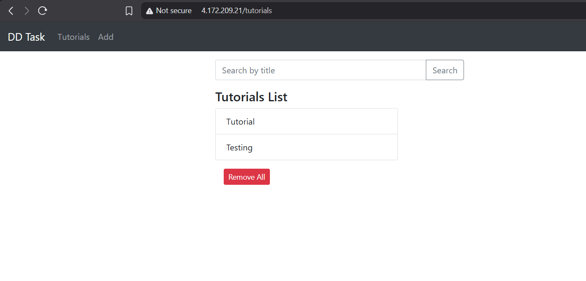
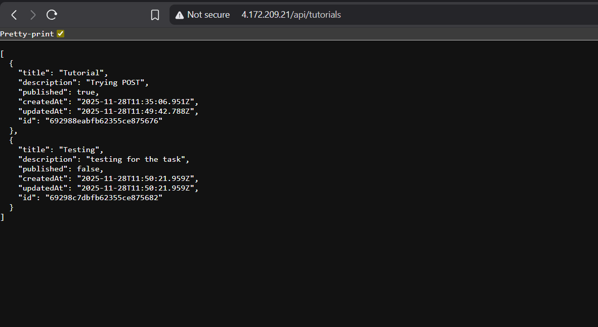
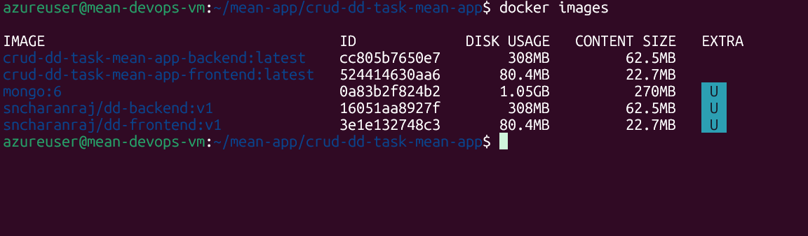
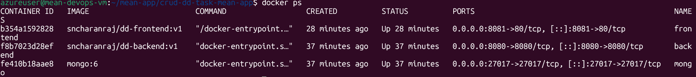
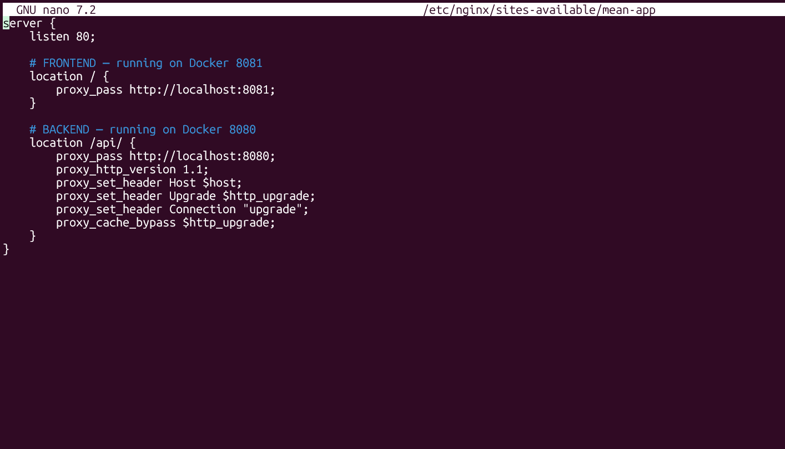
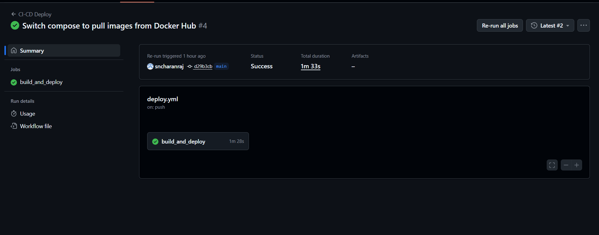

# 📘 MEAN DevOps Assignment — CRUD Tutorial Application

**Candidate:** S N Charanraj  
**Stack:** MongoDB · Express · Angular 15 · Node.js  
**Deployment:** Docker · Docker Compose · Nginx · Azure VM · GitHub Actions CI/CD

---

## 🚀 One-line Summary

Containerized MEAN CRUD application deployed to an Ubuntu VM on Azure with automated CI/CD that builds Docker images, pushes to Docker Hub, and deploys to the VM via SSH. Nginx acts as a reverse proxy and the app is publicly accessible.

---

## 🔎 What This Repo Contains

- `backend/` — Node + Express API (CRUD for Tutorials)  
- `frontend/` — Angular app (UI for CRUD)  
- `Dockerfile`s for frontend & backend  
- `docker-compose.yml` for multi-container deployment (MongoDB, backend, frontend)  
- `.github/workflows/deploy.yml` — CI/CD pipeline to build/push images and deploy to VM  
- `README.md` — this file

---

## 🧠 Architecture Diagram

```
Browser
  └──> Nginx (VM, listens on :80)
       ├── /         -> frontend (Docker container, mapped 8081 -> served)
       └── /api/     -> backend (Docker container, 8080)
                         └──> MongoDB (Docker container)
```

---

## 🗂 Project Structure

```
crud-dd-task-mean-app/
├── backend/
│   ├── Dockerfile
│   ├── package.json
│   ├── server.js
│   └── app/ (config, models, controllers, routes)
├── frontend/
│   ├── Dockerfile
│   ├── package.json
│   └── src/
├── docker-compose.yml
├── .github/workflows/deploy.yml
└── README.md
```

---

## 🐳 Dockerfiles

### Backend (`backend/Dockerfile`)

```dockerfile
FROM node:18-alpine
WORKDIR /app
COPY package*.json ./
RUN npm install --production
COPY . .
EXPOSE 8080
CMD ["npm", "start"]
```

### Frontend (`frontend/Dockerfile`)

```dockerfile
FROM node:18-alpine AS builder
WORKDIR /app
COPY package*.json ./
RUN npm install
COPY . .
RUN npm run build --prod

FROM nginx:alpine
COPY --from=builder /app/dist/angular-15-crud /usr/share/nginx/html/
EXPOSE 80
CMD ["nginx", "-g", "daemon off;"]
```

> **Note:** Adjust the `COPY --from=builder` path if your dist name differs.

---

## 🧩 Docker Compose Configuration

**File:** `docker-compose.yml` (used to run containers on the VM)

```yaml
version: '3.8'

services:
  mongodb:
    image: mongo:6
    container_name: mongo
    restart: always
    ports:
      - "27017:27017"
    volumes:
      - mongo_data:/data/db

  backend:
    image: sncharanraj/dd-backend:v1
    container_name: backend
    restart: always
    environment:
      - MONGO_URL=mongodb://mongodb:27017/testdb
    ports:
      - "8080:8080"
    depends_on:
      - mongodb

  frontend:
    image: sncharanraj/dd-frontend:v1
    container_name: frontend
    restart: always
    ports:
      - "8081:80"
    depends_on:
      - backend

volumes:
  mongo_data:
```

---

## 🔐 Nginx Reverse Proxy Configuration

**File:** `/etc/nginx/sites-available/mean-app` (on VM)

```nginx
server {
    listen 80;

    # Frontend
    location / {
        proxy_pass http://localhost:8081;
    }

    # Backend API
    location /api/ {
        proxy_pass http://localhost:8080;
        proxy_http_version 1.1;
        proxy_set_header Host $host;
        proxy_set_header Upgrade $http_upgrade;
        proxy_set_header Connection "upgrade";
        proxy_cache_bypass $http_upgrade;
    }
}
```

**Enable and reload Nginx:**

```bash
sudo ln -s /etc/nginx/sites-available/mean-app /etc/nginx/sites-enabled/
sudo nginx -t
sudo systemctl restart nginx
```

---

## 🔄 CI/CD Pipeline (GitHub Actions)

**Location:** `.github/workflows/deploy.yml`

**What it does:**

1. On push to `main`, builds backend & frontend Docker images
2. Logs into Docker Hub and pushes images
3. SSH to the Azure VM and runs `docker compose pull` + `docker compose up -d --force-recreate` to redeploy

**Workflow file:**

```yaml
name: CI-CD Deploy

on:
  push:
    branches: [ "main" ]

jobs:
  build_and_deploy:
    runs-on: ubuntu-latest

    steps:
    - uses: actions/checkout@v4

    - name: Login to Docker Hub
      uses: docker/login-action@v3
      with:
        username: ${{ secrets.DOCKER_USERNAME }}
        password: ${{ secrets.DOCKER_PASSWORD }}

    - name: Build & Push Backend
      run: |
        docker build -t sncharanraj/dd-backend:v1 ./backend
        docker push sncharanraj/dd-backend:v1

    - name: Build & Push Frontend
      run: |
        docker build -t sncharanraj/dd-frontend:v1 ./frontend
        docker push sncharanraj/dd-frontend:v1

    - name: Deploy on VM via SSH
      uses: appleboy/ssh-action@v1.2.0
      with:
        host: ${{ secrets.VM_HOST }}
        username: ${{ secrets.VM_USERNAME }}
        key: ${{ secrets.VM_SSH_KEY }}
        script: |
          cd ~/mean-app/crud-dd-task-mean-app
          docker compose pull
          docker compose up -d --force-recreate
```

**Required GitHub Secrets** (Repository Settings → Secrets and variables → Actions):

- `DOCKER_USERNAME` — sncharanraj
- `DOCKER_PASSWORD` — *********
- `VM_HOST` —  (http://4.172.209.21/)
- `VM_USERNAME` — azureuser

---

## ✅ How to Run & Test

### Local Development

**Backend:**
```bash
cd backend
npm install
npm start
# API: http://localhost:8080/api/tutorials
```

**Frontend:**
```bash
cd frontend
npm install
ng serve --port 8081
# UI: http://localhost:8081/
```

### Deploy on VM

SSH to VM and run:
```bash
cd ~/mean-app/crud-dd-task-mean-app
docker compose pull
docker compose up -d --force-recreate
```

### Verify Deployment

- **Frontend UI:** `http://4.172.209.21//`
- **Backend API:** `http://4.172.209.21//api/tutorials`
- **Containers:** `docker ps`
- **Images:** `docker images`

---

## 🧪 API Endpoints

| Method | Path | Description |
|--------|------|-------------|
| GET | `/api/tutorials` | List all tutorials |
| POST | `/api/tutorials` | Create tutorial |
| GET | `/api/tutorials/:id` | Get one tutorial |
| PUT | `/api/tutorials/:id` | Update tutorial |
| DELETE | `/api/tutorials/:id` | Delete tutorial |
| GET | `/api/tutorials/published` | List published tutorials |

---

## 📸 Screenshots

### 1. Frontend UI Running

*Application running successfully at http://YOUR_VM_IP/*

---

### 2. API Response

*Backend API responding at http://YOUR_VM_IP/api/tutorials*

---

### 3. Docker Images on VM

*Docker images successfully pushed and pulled from Docker Hub*

---

### 4. Running Docker Containers

*All containers (MongoDB, Backend, Frontend) running successfully*

---

### 5. Nginx Configuration

*Nginx reverse proxy configuration on VM*

---

### 6. GitHub Actions CI/CD Pipeline

*Successful CI/CD pipeline execution - Build, Push, and Deploy stages*

---

---

## 📝 Notes & Best Practices

- **API Health Check:** Add a simple endpoint for monitoring:
  ```javascript
  app.get('/api', (req, res) => res.json({ status: 'API is live' }));
  ```

- **Docker Healthchecks:** Consider adding healthcheck configurations to containers

- **Production Improvements:**
  - Use managed MongoDB (MongoDB Atlas)
  - Enable HTTPS with Let's Encrypt
  - Implement proper logging and monitoring
  - Use environment-specific configurations

---

## 📦 Deliverables

1. ✅ GitHub repository URL with:
   - Dockerfiles for backend and frontend
   - `docker-compose.yml`
   - `.github/workflows/deploy.yml`
   - Complete source code
   
2. ✅ Screenshots demonstrating:
   - CI/CD pipeline execution
   - Docker images and containers
   - Working application
   - Infrastructure setup

3. ✅ VM kept running for live demonstration

---

## 🏁 What This Project Demonstrates

- ✅ **Containerization** — Docker for consistent environments
- ✅ **Orchestration** — Docker Compose for multi-container setup
- ✅ **CI/CD Automation** — GitHub Actions pipeline
- ✅ **Reverse Proxy** — Nginx for routing and load balancing
- ✅ **Cloud Deployment** — Azure VM infrastructure
- ✅ **DevOps Best Practices** — Infrastructure as Code, automated deployments

---